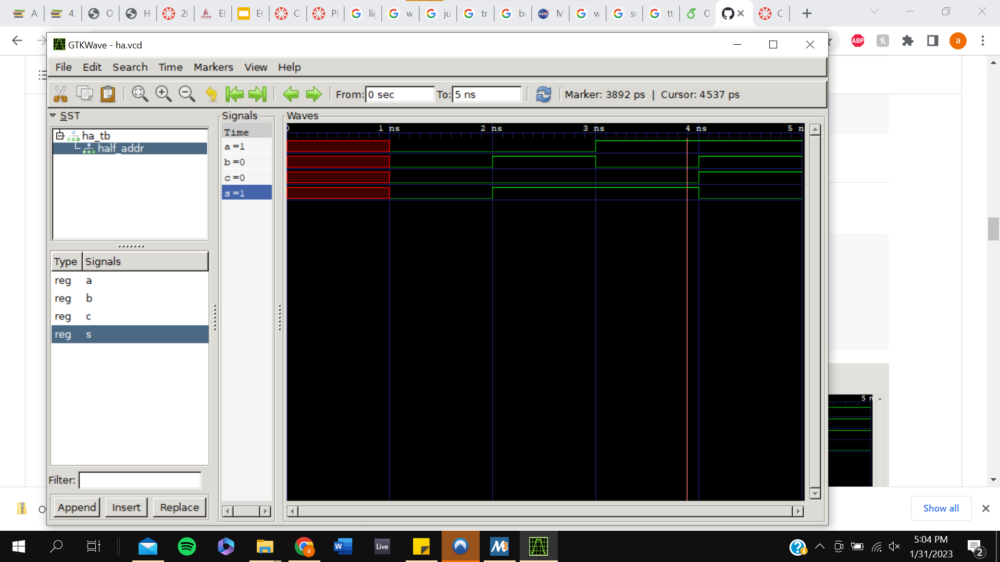

# Lab 1 Documentation

## Installing GHDL and GTKWave

Since I am running MSYS2 with MinGW on my machine, I installed GHDL using the MSYS2 native package, which can be found [here](https://packages.msys2.org/package/mingw-w64-x86_64-ghdl).

There was an error downloading GTKWave using its corresponding MSYS2 package, so I downloaded the binaries [here](https://sourceforge.net/projects/gtkwave/files/) and added the bin folder to my path so MSYS2 would recognize it.

## Half Adder

First I used some GHDL commands before using GTKWave to give a graphical representation of the Half Adder:

'ghdl -a ha.vhdl
 ghdl -a ha_tb.vhdl
 ghdl -e ha_tb
 ghdl -r ha_tb --vcd=ha.vcd'

 Then I used the following command to open GTKWave and display the Half Adder file graphically:

 'gtkwave ha.vcd'
