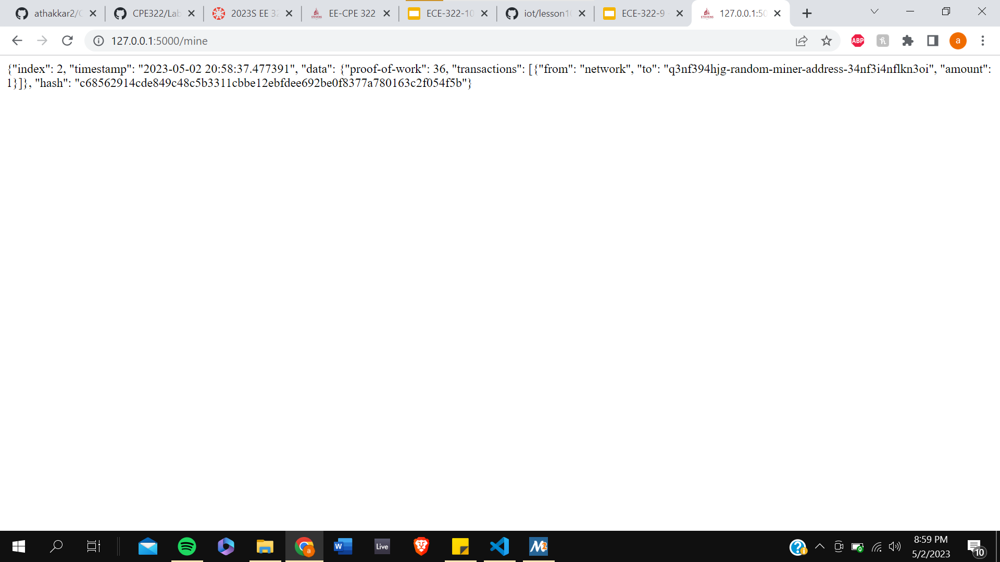

# Lab 8 Documentation

## Blockchain

I first ran the hash_value.py file twice to create two different hashes:

Then, I ran snakecoin.py which uses a simple blockchain algorithm of creating a genesis block then adding to the first block to create the blockchain:

Now I ran the snakecoin server from which I can mine a block and add a block to the chain remotely:

Finally, I cloned the python blockchain app and both mined blocks and posted a message associated to the blocks I mined:

