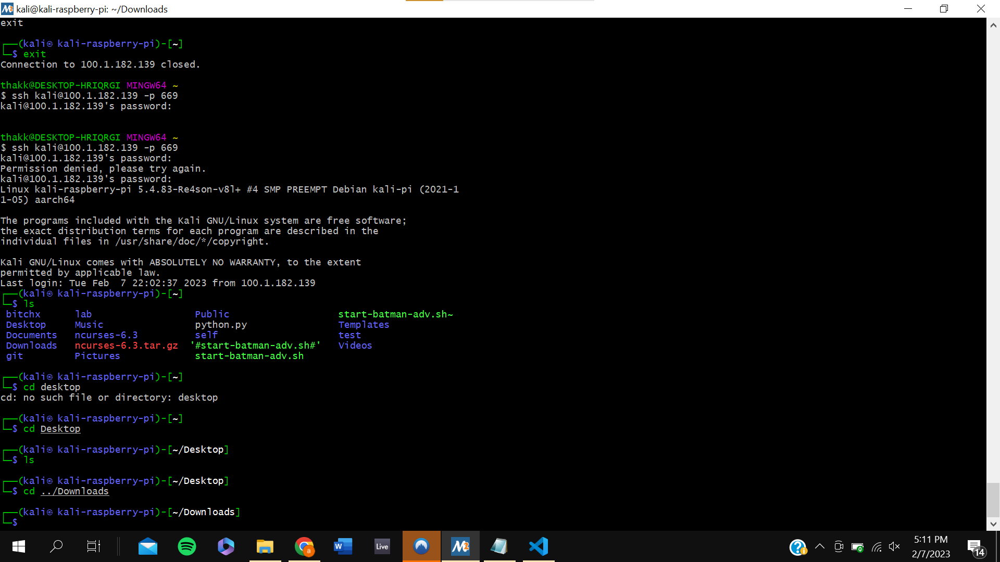

# Lab 2 Documentation

## Raspberry Pi Fun

After setting up port forwarding on my router, I was able to remotely SSH into my Raspberry Pi. Below is a screenshot of my laptop terminal remotely connected to my pi.



## Terminal Commands

I typed in the following commands into my terminal for this lab's demo. I am running MSYS2 on Windows so some of the commands had to be altered like ifconfig.

```bash
hostname
env
ps
pwd
git clone https://github.com/kevinwlu/iot.git
cd iot
ls
cd
df
mkdir demo
cd demo
nano file
cat file
cp file file1
mv file file2
rm file2
clear
man uname
uname -a
ifconfig
ping localhost
netstat
```
To view a full logdump of my terminal while running these commands, please see the [lab2.txt](lab2.txt) file. This was dumped using the script command in my terminal.
