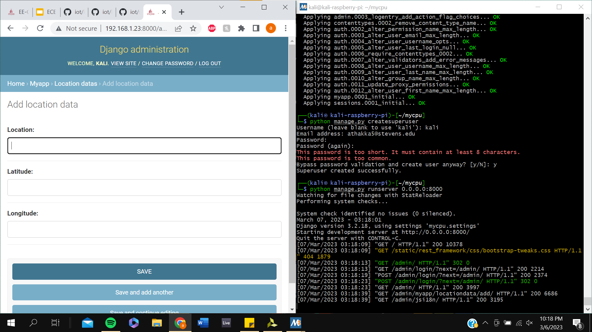
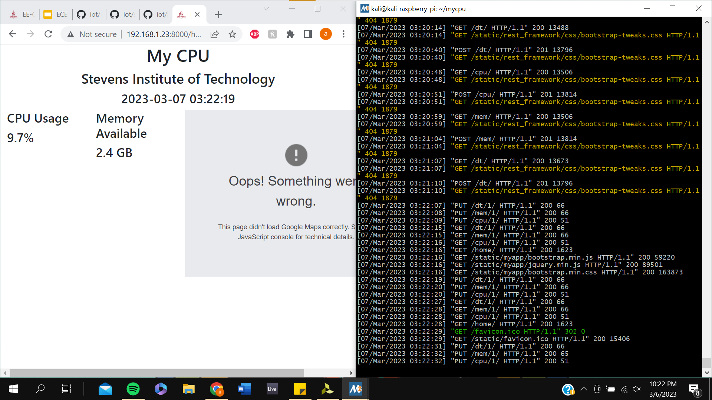
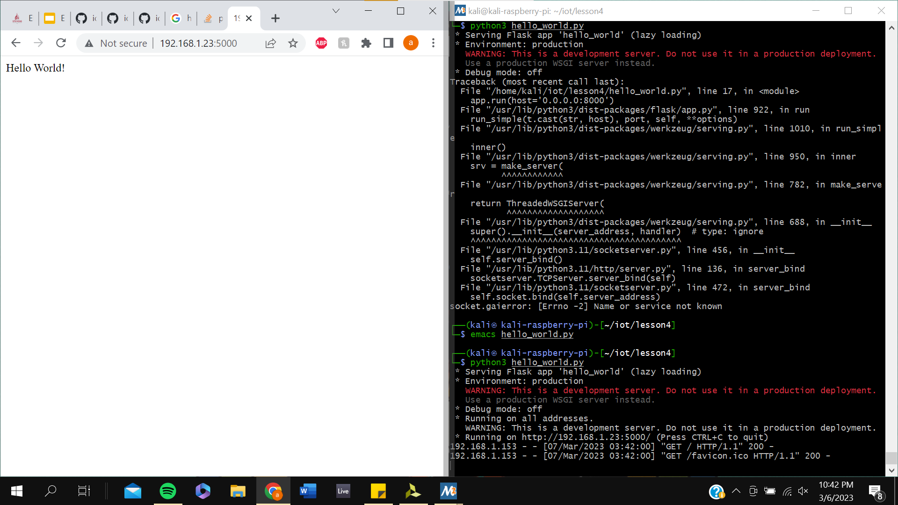

# Lab 4 Documentation

## Part A: Stevens Django Server

First, I SSH'd into my Raspberry Pi running [Kali Linux](https://en.wikipedia.org/wiki/Kali_Linux) on my laptop. Then I had to install the necessary packages, but on Kali Linux I was not able to use the commands that were provided in Professor Lu's documentation. So I used the following commands to install the necessary packages:

```BASH
sudo apt install python3-setuptools
sudo apt install python3-django
sudo apt install python3-djangorestframework
sudo apt install python3-django-filter
sudo apt install python3-markdown
sudo apt install python3-requests
sudo apt install mariadb-server mariadb-client
sudo apt install python3-mysqldb
```

Then I set up MariaDB by running the following command and following the prompts which can be found in the [output log](lab4a.txt):

```BASH
sudo mysql_secure_installation
```

I then started my Django project, started the Django app using the manage.py file that was made, and created a MySQL database that would hold the data I give in the admin page of the website. After creating the database, I used the settings.txt file in Professor Lu's documentation to help change the settings.py file created by Django to use MySQL instead of SQLite3. I also had to add the username and password of the MariaDB user I created so that Django could access the database.

```BASH
django-admin startproject mycpu
cd mycpu
python3 manage.py startapp myapp
sudo mysql -u root -p
cd mycpu
emacs settings.py
```

Then I had to copy the necessary files into my local Stevens project that would be used to host the website:

```BASH
cp ~/iot/lesson4/mycpu/urls.py .
cd ..
cd myapp
cp ~/iot/lesson4/mycpu/admin.py .
cp ~/iot/lesson4/mycpu/models.py .
cp ~/iot/lesson4/mycpu/views.py .
mkdir static templates
cd templates
mkdir myapp
cd myapp
cp ~/iot/lesson4/mycpu/index.html .
cd ~/mycpu/myapp/static
cp ~/iot/lesson4/static/favicon.ico .
mkdir myapp
cd myapp
cp ~/iot/lesson4/static/*css .
cp ~/iot/lesson4/static/*js .
cd ~/mycpu
```

After copying the files into my local folder, I had to create a superuser that could access all the sections of the site including the admin page:

```BASH
python3 manage.py makemigrations myapp
python3 manage.py migrate
python3 manage.py createsuperuser
```

Finally I ran the Django server on my [Local Area Network](https://en.wikipedia.org/wiki/Local_area_network) so that I could access it on my laptop instead of using VNC because I have latency issues with VNC:

```BASH
python3 manage.py runserver 0.0.0.0:8000
```

After the server was running, I now had to access the admin page of the site to input time and temperature data that would appear at the frontend of the page. The admin page takes in the username and password made when you make the superuser, and once logged in the admin site looks like below:


Once the time and temperature data is posted to the database, the home page can pull this data making the frontend of the website look like this (note: I did not want to give my credit card details for the Google Maps API key):


The full log dump of my console while working on Part A can be found [here](lab4a.txt).

## Part B: MyCPU Django Server

First I started my Django server, started the Django app using the manage.py file that was made. Then, I used the settings.txt file in Professor Lu's documentation to help change the settings.py file created by Django.

```BASH
django-admin startproject mycpu
cd mycpu
python3 manage.py startapp myapp
sudo mysql -u root -p
cd mycpu
emacs settings.py
```

Then I had to copy the necessary files into my local Stevens project that would be used to host the website:

```BASH
cp ~/iot/lesson4/mycpu/urls.py .
cd ..
cd myapp
cp ~/iot/lesson4/mycpu/admin.py .
cp ~/iot/lesson4/mycpu/models.py .
cp ~/iot/lesson4/mycpu/views.py .
mkdir static templates
cd templates
mkdir myapp
cd myapp
cp ~/iot/lesson4/mycpu/index.html .
cd ~/mycpu/myapp/static
cp ~/iot/lesson4/static/favicon.ico .
mkdir myapp
cd myapp
cp ~/iot/lesson4/static/*css .
cp ~/iot/lesson4/static/*js .
cd ~/mycpu
```

After copying the files into my local folder, I had to create a superuser that could access all the sections of the site including the admin page:

```BASH
python3 manage.py makemigrations myapp
python3 manage.py migrate
python3 manage.py createsuperuser
```

Then I had to copy controller.py into my root directory for the project and change the username and password in views.py and controller.py to the superuser details.

```BASH
cp ~/iot/lesson4/mycpu/controller.py .
emacs controller.py
emacs views.py
```

Finally I ran the Django server on my [Local Area Network](https://en.wikipedia.org/wiki/Local_area_network) so that I could access it on my laptop instead of using VNC because I have latency issues with VNC:

```BASH
python3 manage.py runserver 0.0.0.0:8000
```

After the server was running, I now had to access the admin page of the site to post data for DT, CPU, and MEM that would appear at the frontend of the page. The admin page takes in the username and password made when you make the superuser, and once logged in the admin site looks like below:



Then I SSH'd into my Pi using another terminal on my laptop and ran controller.py separately. This would record my CPU and memory usage and pass it to the instance of Django that was running. This made the front end of the website look like this (note: I did not want to give my credit card details for the Google Maps API key):



The full log dump of my console while working on Part B can be found [here](lab4b.txt).

## Part C: Flask

Flask is an alternative python package that can host a website on a local machine. To run the hello_world.py script on my LAN, I had to pass in '0.0.0.0' to the host parameter in Flask's run method:

```Python
from flask import Flask
from flask import send_from_directory
import os
app = Flask(__name__)

@app.route("/")
def hello():
    return "Hello World!"

@app.route('/favicon.ico')
def favicon():
    return send_from_directory(os.path.join(app.root_path, 'static'),
                               'favicon.ico', 
                               mimetype='image/vnd.microsoft.icon')

if __name__ == "__main__":
    app.run(host='0.0.0.0')
```

After this, I ran the hello_world script which hosted the website on my Pi to my local network. This meant I could access the website on my laptop, which looked like this:


