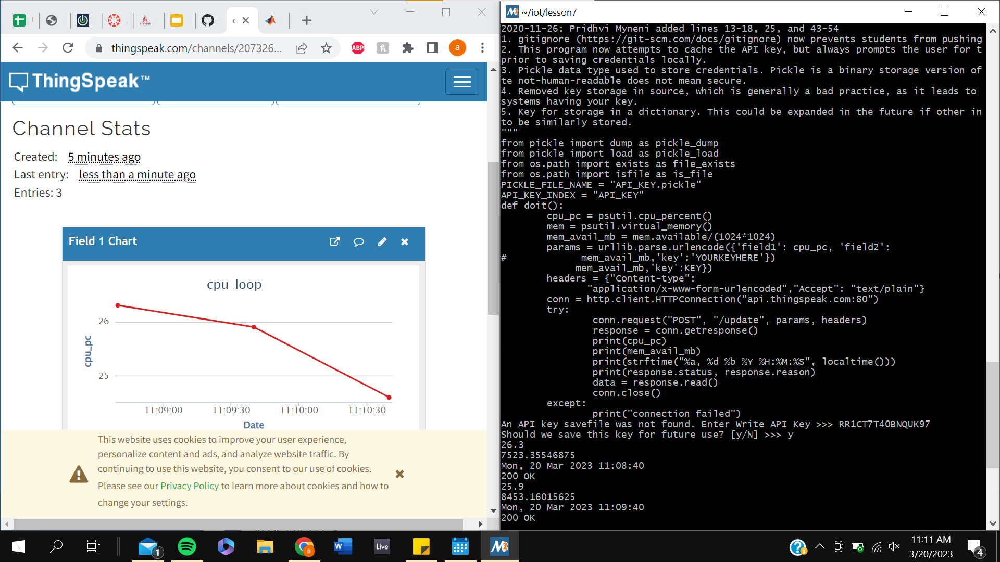
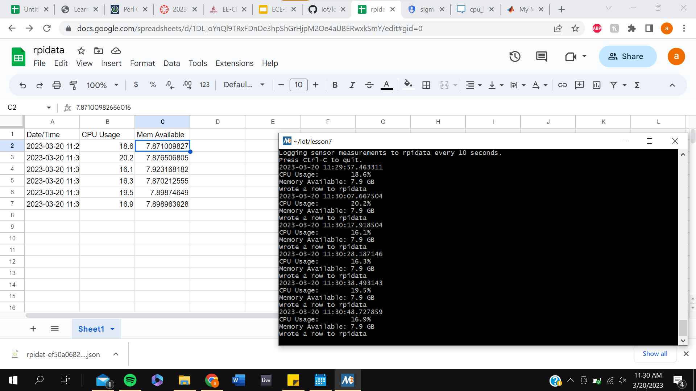

# Lab 7 Documentation

## Thingspeak

After signing up for thingspeak, I created a new channel for my CPU data. Then, I copied my API key from the website and used the following command in my terminal to pass my API key to the python script:

```bash
sudo pip3 install -U psutil
cd ~/demo
cp ~/iot/lesson7/thingspeak_cpu_loop.py .
cp ~/iot/lesson7/thingspeak_feed.py .
cat thingspeak_cpu_loop.py
cat thingspeak_feed.py
python3 thingspeak_feed.py
An API key savefile was not found. Enter Write API Key >>>
Should we save this key for future use? [y/N] >>>
```

Then by running the python script, I could see my thingspeak channel automatically update as can be seen in the following picture.



After my thingspeak was working, I wanted my CPU data to appear on a google spreadsheet. To do this, I use the cpu_spreadsheet.py script so that it can run on my laptop. I used Google Cloud Platform Identity and Access Management to enable my Drive API and Sheets API and retreive a JSON key. I then have to share my google spreadsheet with the service account email address that was provided in the JSON key. After doing this, I had to include my JSON key into the cpu_spreadsheet.py and then ran it to get the following updating spreadsheet.



For a full log dump of my terminal please click [here](lab7.txt).
