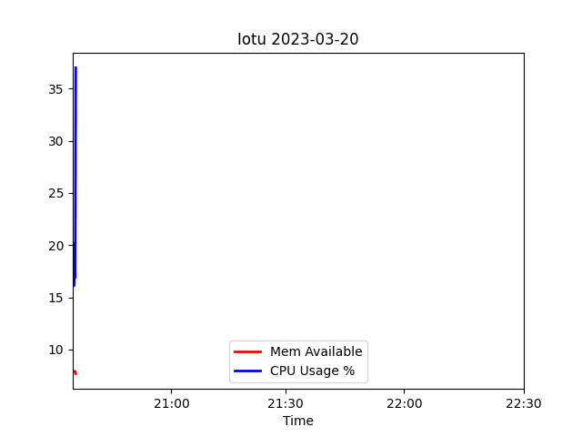
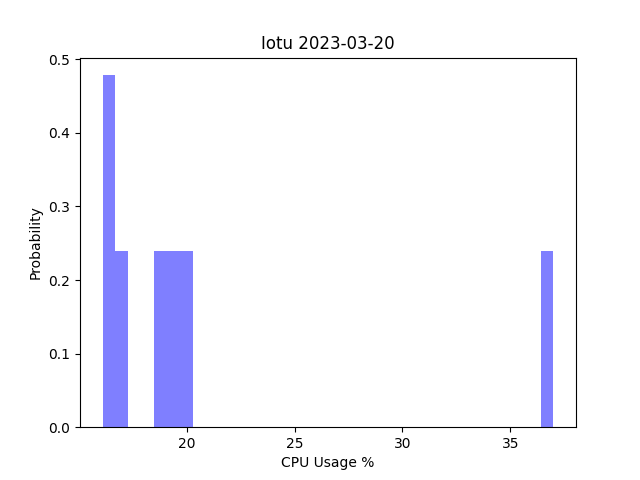
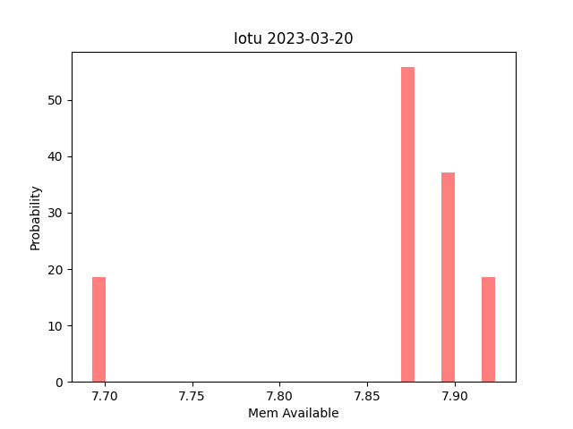
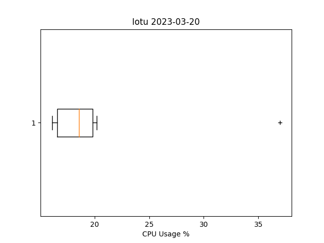
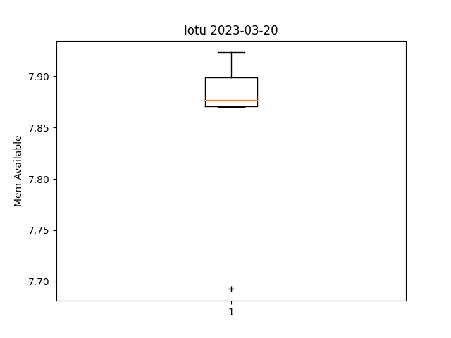
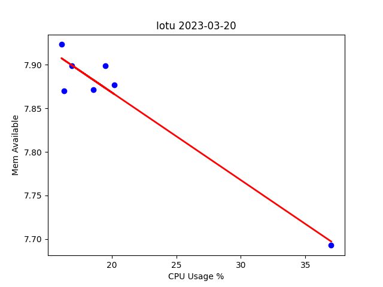

# Lab 8 Documentation

## Pandas, Matplotlib, Sklearn

Using the excel sheet from the last lab, I downloaded the required python libraries to run the two scripts but saw errors because of discrepancies between the excel sheet and the python scripts. I fixed these errors by changing the column names in the python script to match the column names in the excel sheets:

```python
data = read_csv('rpidata1.csv')
x = data['CPU Usage']
y = data['Mem Available']
```

In plt_cv2.py, a certain parameter was being passed in that was greater than the amount of samples I had, so I had to change the parameter to match my data:

```python
predicted = cross_val_predict(lr, X, y, cv=7)
```

Then I was able to run the python scripts and get the following graphs:






