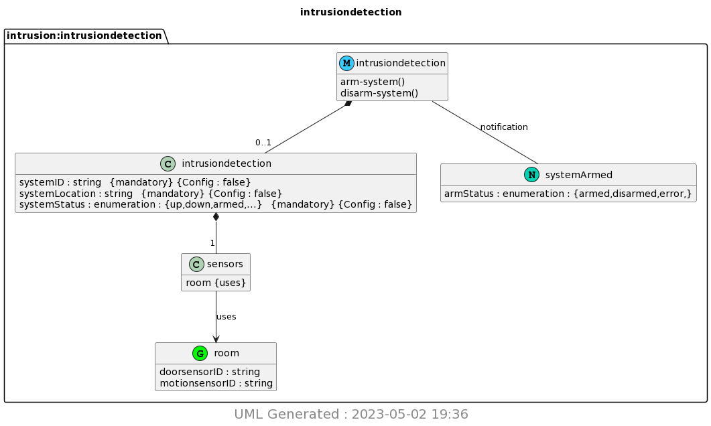

# Lab 8 Documentation

## Yang, PlantUML

First I downloaded the necessary libraries, then ran the following commands to produce my PNG:

```bash
pyang -f yin -o intrusiondetection.yin intrusiondetection.yang
cat intrusiondetection.yin
pyang -f uml -o intrusiondetection.uml intrusiondetection.yang --uml-no=stereotypes,annotation,typedef
cat intrusiondetection.uml
python3 -m plantuml intrusiondetection.uml
```
This yielded the following PNG:

