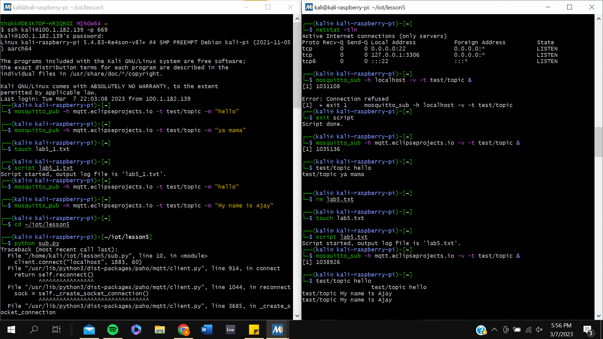

# Lab 5 Documentation

## MQTT Overview

MQTT or MQ Telemetary Transport is a lightweight convention for sending messages from machine to machine. It involves a publisher and subscriber, where the publisher will establish the "port" where communication will occur and send messages to the subscriber. The subscriber must connect to the "port" and will receive all subsequent messages the publisher sends. This port is hosted on a broker, which is effectively a middle-man which knows which machine to accept messages from and which machine to send those messages to. More on MQTT can be found [here](https://en.wikipedia.org/wiki/MQTT).

## Mosquitto MQTT

After installing Mosquitto, I had trouble initializing the port to transmit on my local host. So, I established my port and sent a message on the Mosquitto test server as can be seen below (Done on Terminal 1):

```bash
mosquitto_pub -h mqtt.eclipseprojects.io -t test/topic -m "Hello"
```

Then, to subscribe to this test server and retrieve the message I sent I had to enter the following comand on my second terminal:

```bash
mosquitto_sub -h mqtt.eclipseprojects.io -v -t test/topic &
```

This printed the message sent by the publisher on my terminal, which can be seen below:



## Paho

After installing Paho, I ran the subcpu.py and pubcpu.py scripts to publish my CPU usage and retrieve those messages on another terminal. This was done using the following commands:

```bash
python3 subcpu.py
python3 pubcpu.py
```

Then, my subscriber terminal started outputting my CPU usage, as can be seen below:
